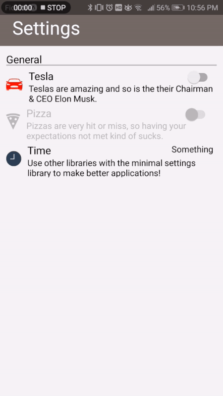

# React Native Minimal Settings

A cross-platform Settings component for React Native.

## Features

- Settings Title
- Category Title
- Switch Button Preference
- Dividing Line

and much more to come!

## Demo



## Installation

```sh
npm i react-native-minimal-settings
```

## Quick Start

```js
import React from 'react';
import { View } from 'react-native';
import {CategoryTitle, DividingLine, SettingTitle, SwitchButton, StringCategory} from 'react-native-minimal-settings';
import DateTimePicker from 'react-native-modal-datetime-picker';

export default class App extends React.Component {

  constructor() {
    super();
    this.state = {
       teslaValue: false,
       pizzaValue: false,
       isDateTimePickerVisible: false,
       stringCategoryValue: 'Something',
    }
 }

 teslaSwitch = (value) => {
   this.setState({teslaValue: value});
 }

 pizzaSwitch = (value) => {
   //Unfortunately pizza disappointed me so it's disabled
   this.setState({pizzaValue: value});
 }

 _showDateTimePicker = () => {
     this.setState({ isDateTimePickerVisible: true });
 }

 _hideDateTimePicker = () => this.setState({ isDateTimePickerVisible: false });

  _handleDatePicked = (time) => {
    console.log('A time has been picked: ', time);
    this.setState({stringCategoryValue: this._createTime(time.getHours(), time.getMinutes())});
    this._hideDateTimePicker();
  };

  _createTime = (hours, minutes) => {
    if(minutes < 10) {
      minutes = '0'+minutes;
    }
    return hours + ':'+minutes;
  }

  render() {
    return (
      <View style={{ flex: 1, backgroundColor: '#F5F5F5'}}>
        <SettingTitle
          title = {"Settings"}
          titleBackgroundColor = {'#746965'}
          titleColor = {'white'}          
        />
        <CategoryTitle
          title = {'General'}
        />
        <DividingLine
          lineColor = {'rgba(128, 128, 128, 0.5)'}
        />
        <SwitchButton
          title = {'Tesla'}
          toggleSwitch = {this.teslaSwitch}
          switchValue = {this.state.teslaValue}
          description = {"Teslas are amazing and so is the their Chairman & CEO Elon Musk."}
          blockIcon = {"ios-car"}
          iconColor = {"red"}
        />
        <SwitchButton
          title = {'Pizza'}
          toggleSwitch = {this.pizzaSwitch}
          switchValue = {this.state.pizzaValue}
          description = {'Pizzas are very hit or miss, so having your expectations not met kind of sucks.'}
          blockIcon = {"md-pizza"}
          iconColor = {"skyblue"}
          isDisabled = {true}
        />
        <StringCategory
          title = {'Time'}
          description = {'Use other libraries with the minimal settings library to make better applications!'}
          blockIcon = {'ios-time'}
          iconColor = {'#2E4053'}
          initialValue = {this.state.stringCategoryValue}
          blockAction = {this._showDateTimePicker}
        />
        <DateTimePicker
          isVisible={this.state.isDateTimePickerVisible}
          onConfirm={this._handleDatePicked}
          onCancel={this._hideDateTimePicker}
          mode = {'time'}
        />
      </View>
    );
  }
}
```

## API reference

### `<SettingTitle />`

Container component responsible for rendering the screen header.

#### Example

```js
<SettingTitle
  title = {"Settings"}
  titleBackgroundColor = {'#1f5fa5'}
  titleColor = {'white'}          
/>
```

#### Props

- `title` (required): Title of the header.
- `titleBackgroundColor` (required): Background color of the header .
- `titleColor` (required): Color of the header text.

### `<CategoryTitle />`

Container component responsible for rendering the title of a category.

#### Example

```js
<CategoryTitle
  title = {'General'}
/>
```

#### Props

- `title` (required): Title of the category.

#### Props

- `title` (required): Title of the header.
- `titleBackgroundColor` (required): Background color of the header .
- `titleColor` (required): Color of the header text.

### `<DividingLine />`

Component responsible for making a line to divide categories or titles from categories.

#### Example

```js
<DividingLine
  lineColor = {'rgba(128, 128, 128, 0.5)'}
/>
```

#### Props

- `lineColor` (required): Dividing line between categories or between title and category.

### `<SwitchButton />`

Container component responsible for rendering the boolean settings block.

#### Example

```js
<SwitchButton
  title = {'Notifications'}
  toggleSwitch = {this._handleNotification}
  switchValue = {this.state.notificationValue}
  description = {'Receive notifications.'}
  blockIcon = {"md-notifications"}
  iconColor = {"skyblue"}
  isDisabled = {false}
/>
```

#### Props

- `title`: Title of the preference block.
- `toggleSwitch` (required): Callback for when the switch button gets toggled.
- `switchValue` (required): Value of the switch button.
- `description` (required): Description of the function of the switch button.
- `blockIcon`  (required): Icon of the preference block taken from [Expo's vector icon directory](https://expo.github.io/vector-icons/)
- `iconColor` (required): The color of the icon.
- `isDisabled` (optional): Disables the entire preference block.

### `<StringCategory />`

Container component responsible for rendering the value of the category as a text.

#### Example

```js
<StringCategory
  title = {'Name'}
  description = {'Show the name that the user set as their preference in this block!'}
  blockIcon = {'ios-happy'}
  iconColor = {'#2E4053'}
  initialValue = {this.state.usersName}
  blockAction = {this._enterUsersNameModal}
/>
```

#### Props

- `title`: Title of the preference block.
- `description` (required): Description of the function of the category.
- `blockIcon`  (required): Icon of the preference block taken from [Expo's vector icon directory](https://expo.github.io/vector-icons/)
- `iconColor` (required): The color of the icon.
- `initialValue` (required): Displays the value of the category block.
- `blockAction` (required): Function handling the action of pressing on the category.